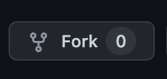

# Hai semua 👋

<!-- ALL-CONTRIBUTORS-BADGE:START - Do not remove or modify this section -->

<!-- ALL-CONTRIBUTORS-BADGE:END -->

di repo ini, temen" semua akan belajar bagaimana cara berkolaborasi

1. pertama fork dlu repo ini
   

2. Buat `branch` kalian sendiri dengan mengambil dari `branch master`.

3. dan setelah itu kalian bisa mulai buat file berdasarkan username github kalian contoh `xxidbr9.md` di folder `./contributors`, dan isi dengan biodata diri kalian, jangan lupa tambah link menuju biodata di file `README.md` ini!!.

4. untuk kalian yang sudah paham bisa lanjut buat bikin `pull request` dari `branch` yang sudah kalian buat.

5. kalau kalian yang bingung cara kolaborasinya bagaimana, kalian yang sudah paham bisa bantu temen kalian yang kesulitan.

6. kalian bisa tiru contoh penulisan data diri disini https://zzetao.github.io/awesome-github-profile/

### BIODATA KONTRIBUTOR

<!-- Tambah nama lengkap kalian dan link ke file yang kalian buat  -->
<!-- [nama_lengkap_kalian](./contributors/<username>.md) -->
- [Barnando Akbarto Hidayatullah](./contributors/xxidbr9.md)
- [I Putu Adi Sanjaya](./contributors/adiiisanjayaa.md)
- [Philipus Agri Adhiatma](./contributors/AgriAdhiatma24.md)
- [Addien Aisar Rauda](./contributors/Aisarr.md)
- [Dimas Rachmadika](./contributors/dimasrdika.md)
- [Muhamad Yusuf Rama Dika](./contributors/ramadika.md)
- [Rizki Kurnia Putra](./contributors/lobaydev.md)
- [Rabian Ikwan](./contributors/rabianikwan.md)
- [Sandra Marsella](./contributors/san03.md)
- [Farhan Hermawan](./contributors/FarhanHermawan.md)
- [Rizal Rahmatulloh](./contributors/rizalrahmatulloh.md)
- [Moh. Yusril Mahendra](./contributors/myusrilmahendra.md)
- [Andika Pramudita](./contributors/Kambium98.md)
- [Azmi Alianda](./contributors/Milliand3.md)
- [Yudha Adhi Pangestu](./contributors/accelup.md)
- [Deni Prayoga](./contributors/deni.md)

<!-- YANG DIBAWAH INI SAMPAI BAWAH JANGAN DI EDIT -->
<!-- INI OTOMATIS GENERATE DARI BOT -->

## Contributors ✨

Thanks goes to these wonderful people ([emoji key](https://allcontributors.org/docs/en/emoji-key)):

<!-- ALL-CONTRIBUTORS-LIST:START - Do not remove or modify this section -->
<!-- prettier-ignore-start -->
<!-- markdownlint-disable -->
<table>
  <tbody>
    <tr>
      <td align="center" valign="top" width="14.28%"><a href="http://github.com/xxidbr9"> <b>Barnando Akbarto Hidayatullah</b></a> <a href="https://github.com/xxidbr9/binar-intro-collaboration/commits?author=xxidbr9" title="Code">💻</a></td>
      <td align="center" valign="top" width="14.28%"><a href="https://github.com/adiiisanjayaa"> <b>I Putu Adi Sanjaya</b></a> <a href="https://github.com/xxidbr9/binar-intro-collaboration/commits?author=adiiisanjayaa" title="Code">💻</a></td>
      <td align="center" valign="top" width="14.28%"><a href="https://github.com/AgriAdhiatma24"> <b>AgriAdhiatma24</b></a> <a href="https://github.com/xxidbr9/binar-intro-collaboration/commits?author=AgriAdhiatma24" title="Code">💻</a></td>
      <td align="center" valign="top" width="14.28%"><a href="https://github.com/dimasrdika"> <b>Dimas Rachmadika</b></a> <a href="https://github.com/xxidbr9/binar-intro-collaboration/commits?author=dimasrdika" title="Code">💻</a></td>
      <td align="center" valign="top" width="14.28%"><a href="https://github.com/yrdikaa"> <b>yrdikaa</b></a> <a href="https://github.com/xxidbr9/binar-intro-collaboration/commits?author=yrdikaa" title="Code">💻</a></td>
      <td align="center" valign="top" width="14.28%"><a href="https://github.com/lobaydev"> <b>Rizki Kurnia Putra</b></a> <a href="https://github.com/xxidbr9/binar-intro-collaboration/commits?author=lobaydev" title="Code">💻</a></td>
      <td align="center" valign="top" width="14.28%"><a href="http://rabianikwan.github.io"> <b>Rabian Ikwan</b></a> <a href="https://github.com/xxidbr9/binar-intro-collaboration/commits?author=rabianikwan" title="Code">💻</a></td>
    </tr>
    <tr>
      <td align="center" valign="top" width="14.28%"><a href="https://github.com/FarhanHermawan"> <b>FarhanHermawan</b></a> <a href="https://github.com/xxidbr9/binar-intro-collaboration/commits?author=FarhanHermawan" title="Code">💻</a></td>
      <td align="center" valign="top" width="14.28%"><a href="https://github.com/Aisarr"> <b>Aisarr</b></a> <a href="https://github.com/xxidbr9/binar-intro-collaboration/commits?author=Aisarr" title="Code">💻</a></td>
      <td align="center" valign="top" width="14.28%"><a href="https://github.com/San033"> <b>San033</b></a> <a href="https://github.com/xxidbr9/binar-intro-collaboration/commits?author=San033" title="Code">💻</a></td>
      <td align="center" valign="top" width="14.28%"><a href="https://github.com/Kambium98"> <b>Kambium98</b></a> <a href="https://github.com/xxidbr9/binar-intro-collaboration/commits?author=Kambium98" title="Code">💻</a></td>
      <td align="center" valign="top" width="14.28%"><a href="https://github.com/myusrilmahendra"> <b>Moh. Yusril Mahendra</b></a> <a href="https://github.com/xxidbr9/binar-intro-collaboration/commits?author=myusrilmahendra" title="Code">💻</a></td>
      <td align="center" valign="top" width="14.28%"><a href="https://github.com/Milliand3"> <b>Milliand3</b></a> <a href="https://github.com/xxidbr9/binar-intro-collaboration/commits?author=Milliand3" title="Code">💻</a></td>
      <td align="center" valign="top" width="14.28%"><a href="https://github.com/rizalrahmatulloh"> <b>Rizal Rahmatulloh</b></a> <a href="https://github.com/xxidbr9/binar-intro-collaboration/commits?author=rizalrahmatulloh" title="Code">💻</a></td>
    </tr>
    <tr>
      <td align="center" valign="top" width="14.28%"><a href="https://github.com/AccelUp"> <b>AccelUp</b></a> <a href="https://github.com/xxidbr9/binar-intro-collaboration/commits?author=AccelUp" title="Code">💻</a></td>
    </tr>
  </tbody>
</table>

<!-- markdownlint-restore -->
<!-- prettier-ignore-end -->

<!-- ALL-CONTRIBUTORS-LIST:END -->

<!-- ALL-CONTRIBUTORS-LIST:START - Do not remove or modify this section -->
<!-- prettier-ignore-start -->
<!-- markdownlint-disable -->

<!-- markdownlint-restore -->
<!-- prettier-ignore-end -->

<!-- ALL-CONTRIBUTORS-LIST:END -->

This project follows the [all-contributors](https://github.com/all-contributors/all-contributors) specification. Contributions of any kind welcome!
